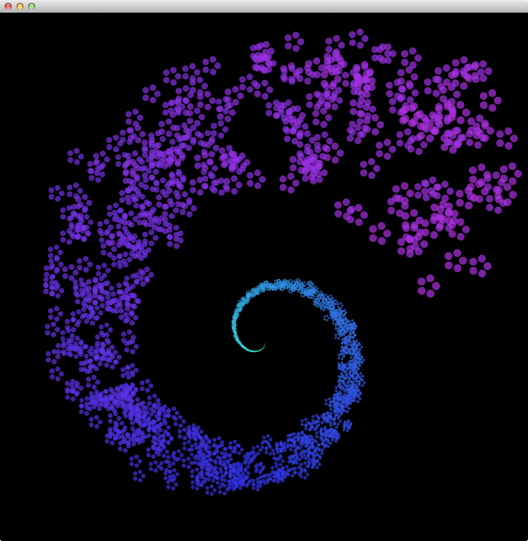

# Vectors - Exercise 1.1

> Find something you’ve previously made in Processing using separate x and y variables and use PVectors instead.

[Link](http://natureofcode.com/book/chapter-1-vectors/#chapter01_exercise1)

