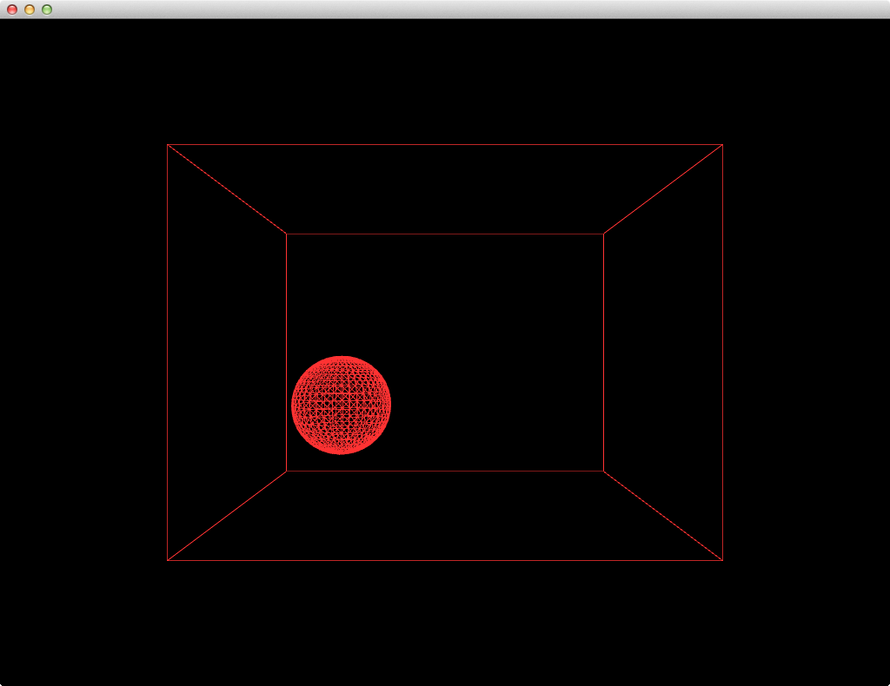

# Vectors - Exercise 1.3

> Extend the bouncing ball with vectors example into 3D. Can you get a sphere to bounce around a box?

[Link](http://natureofcode.com/book/chapter-1-vectors/#chapter01_exercise3)

