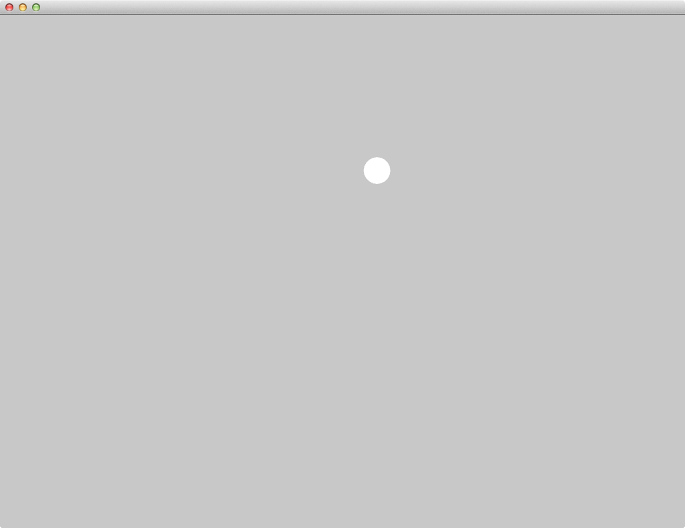

# Vectors - Exercise 1.8

> Try implementing the above example with a variable magnitude of acceleration, stronger when it is either closer or farther away.

Circle accelerates towards mouse.

[Link](http://natureofcode.com/book/chapter-1-vectors/#chapter01_exercise8)

